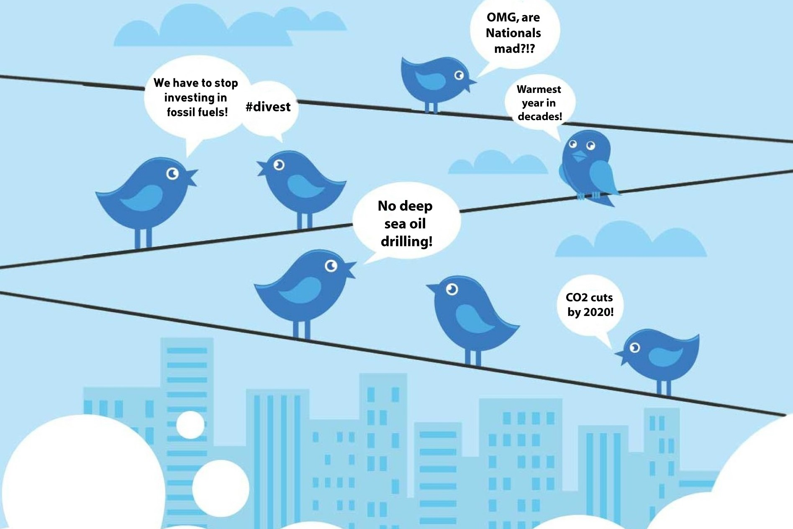

# TwitterSocialMediaAnalysis_ClimateChange

## Introduction

Given the recent explosion of Big Data, there is a growing demand for analyzing non traditional data sources. Social Media data is a big source of this data in form of chats, messages, news feeds and all of it is in an unstructured form. 
Text analytics is a process that helps analyze this unstructured data and look for patterns or deduce popular sentiment which further helps organizations in their desicion making.

Twitter data (commonly know as tweets) is a incredibly powerful source of information on an extensive list of topics. This data can be analyzed to find trends related to specific topic, measure popular sentiment, obtain feedback on past desicions and also help make future desicions.
#### TwitterSocialMediaAnalysis_ClimateChange :
This project is an approach towards analyzing popular sentiment on Climate Change using twitter data collected for some of the most trending hashtags related to Climate Change. Further, machine learning models have been developed in order to help a user predict an applicable climate change hashtag and ascertain the sentiment of a tweet entered by her.

## Text Analytics Workflow for Twitter Data - 

 

## Collect Data 

Using twitter’s API one can not mine tweets older than seven days. 
I found the GetOldTweets-python tool originally developed by Jefferson Henrique:https://github.com/Jefferson-Henrique/GetOldTweets-python in Python version 2.x, and later modified by Dmitri Mottl:https://github.com/Mottl/GetOldTweets3 in Python version 3.x, which was very helpful, and allowed me to obtain almost 50000+ tweets for the year of 2019, for 

> Florida, Chicago, Newyork, California – in USA

> London, Paris, Cairo, Moscow, Sydney, Mumbai, India, Sweden, Australia, Mexico, Shangai – outside USA

Tweets obtained were based on trending climate related hashtags 
> search_hashtags=['#climateStrike','#climatestrike','#climatechange','#GreenNewDeal','#climatecrisis','#climateAction',
>                  '#FridaysForFuture','#environment','#globalwarming','#GlobalWarming','#ActOnClimate',
>                  '#sustainability','#savetheplanet','#bushfiresAustralia','#bushfires’]

## Sentiment Analysis

TextBlob and VaderSentiment Analyzer were used to measure the sentiments of the collected tweet, and based on the VaderSentiment Analyzer, obtained the Avg Vader Compound for each trending hashtag and developed some visualizations to get some insight in the story behind a sentiment.
For eg- Hashtag Climate Strike was trending in Sept 2019, because of School Strikes for climate change and it had negative/positive sentiments shown in tweets.

## Supervised Learning 

The tweet data is not a pre-labeled data, for this project. And hence a categorical feature the hashtags which were used to retrieve tweet data were used as ***Y*** And the tweet Text is used as feature for ***X***

## Natural Language Processing

Prior to training the model, we needed to do some processing to the text data. 
Text cleaning step includes removing URL's, remove stop words, change text to lower case, remove punctuation, remove bad characters and so on.

After splitting the data set, the next steps includes feature engineering. Using TfidfVectorizer we will convert our text documents to a matrix of token counts and transform a count matrix to a normalized tf-idf representation (using TfidfVectorizer.fit_transform). After that, we train several classifiers from Scikit-Learn library.

## Machine Learning Models
To make the vectorizer => transformer => classifier easier to work with, we will use Pipeline class in Scilkit-Learn that behaves like a compound classifier.

After we have our features, we can train a classifier to try to predict the most applicable hashtag of a user entered Tweet, and suggests it to the user help him/her use it for more visibility.

***Naive Bayes Classifier for Multinomial Models*** 
The multinomial Naive Bayes:https://scikit-learn.org/stable/modules/generated/sklearn.naive_bayes.MultinomialNB.html classifier is suitable for classification with discrete features (e.g., word counts for text classification). The multinomial distribution normally requires integer feature counts. However, in practice, fractional counts such as tf-idf may also work.

***_0.62% Accuracy_***
              precision    recall  f1-score   support

           0       0.71      0.51      0.60       549
           1       0.63      0.51      0.57       278
           2       0.51      0.36      0.42      1972
           3       0.52      0.66      0.58      4810
           4       0.47      0.34      0.39      1514
           5       0.70      0.85      0.77      5562
           6       0.57      0.50      0.53      1373
           7       0.43      0.28      0.34       901
           8       0.73      0.67      0.70      1262
           9       0.76      0.64      0.69      1380
          10       0.61      0.39      0.47       407
          11       0.77      0.66      0.71      1714

    accuracy                           0.62     21722
    macro avg      0.62      0.53      0.56     21722
    weighted avg   0.62      0.62      0.61     21722
    
    

***Linear Support Vector Machine*** ***_0.85% Accuracy_***
                      precision    recall  f1-score   support

        #actonclimate       0.92      0.70      0.80       568
           #bushfires       0.91      0.77      0.83       270
       #climateaction       0.91      0.64      0.75      1913
       #climatechange       0.81      0.90      0.85      4857
       #climatecrisis       0.89      0.70      0.78      1495
       #climatestrike       0.84      0.96      0.89      5507
       #environment         0.86      0.85      0.86      1411
       #fridaysforfuture    0.97      0.46      0.62       911
       #globalwarming       0.82      0.87      0.84      1246
        #greennewdeal       0.87      0.91      0.89      1377
       #savetheplanet       0.94      0.78      0.85       430
      #sustainability       0.88      0.97      0.92      1737

         accuracy                           0.85     21722
        macro avg       0.89      0.79      0.82     21722
     weighted avg       0.86      0.85      0.85     21722
     
***Logistic Regression Model*** 
Logistic regression, despite its name, is a linear model for classification rather than regression. Logistic regression is also known in the literature as logit regression, maximum-entropy classification (MaxEnt) or the log-linear classifier. In this model, the probabilities describing the possible outcomes of a single trial are modeled using a logistic function. [ref]:https://scikit-learn.org/stable/modules/linear_model.html#logistic-regression

***_0.82% Accuracy_***

                           precision    recall  f1-score   support

        #actonclimate       0.85      0.73      0.79       568
           #bushfires       0.91      0.84      0.87       270
       #climateaction       0.74      0.66      0.70      1913
       #climatechange       0.81      0.81      0.81      4857
       #climatecrisis       0.76      0.68      0.72      1495
       #climatestrike       0.82      0.94      0.88      5507
         #environment       0.85      0.84      0.84      1411
    #fridaysforfuture       0.83      0.53      0.65       911
       #globalwarming       0.80      0.86      0.83      1246
        #greennewdeal       0.88      0.87      0.88      1377
       #savetheplanet       0.90      0.81      0.85       430
      #sustainability       0.89      0.91      0.90      1737

             accuracy                           0.82     21722
            macro avg       0.84      0.79      0.81     21722
         weighted avg       0.82      0.82      0.82     21722
     
***RandomForestClassifier**** ***_0.79% Accuracy_***

                           precision    recall  f1-score   support

        #actonclimate       0.81      0.72      0.76       568
           #bushfires       0.82      0.78      0.80       270
       #climateaction       0.67      0.66      0.66      1913
       #climatechange       0.79      0.77      0.78      4857
       #climatecrisis       0.70      0.67      0.69      1495
       #climatestrike       0.81      0.86      0.83      5507
         #environment       0.83      0.82      0.82      1411
    #fridaysforfuture       0.59      0.50      0.54       911
       #globalwarming       0.80      0.83      0.81      1246
        #greennewdeal       0.85      0.87      0.86      1377
       #savetheplanet       0.85      0.79      0.82       430
      #sustainability       0.89      0.88      0.88      1737

             accuracy                           0.79     21722
            macro avg       0.78      0.76      0.77     21722
         weighted avg       0.79      0.79      0.79     21722

## Parameter Tuning - GridSearchCV

Futher all of these model were tuned with various parameters to achieve a better accuracy results.
***Naive Bayes Classifier for Multinomial Models***
> Best cross-validation score: 0.66
> Best parameters:  {'clf__alpha': 0.01, 'tfidf__ngram_range': (1, 2), 'tfidf__use_idf': False}

***Linear Support Vector Machine***
> Best cross-validation score: 0.86
> Best parameters:  {'clf__C': 0.01, 'tfidf__ngram_range': (1, 1), 'tfidf__use_idf': False}

***Logistic Regression***
> Best cross-validation score: 0.83
> Best parameters:  {'C': 1}

***Random Forest Classifier***
> max_depth=125, n_estimators=250, score=0.816

## Conclusion -
Best model as per accuracy is Linear SVC to predict a applicable hashtag.

Further improvement can be acheived by using Stemming and Lemmatization on the text data, and then classifying will give a better results.

